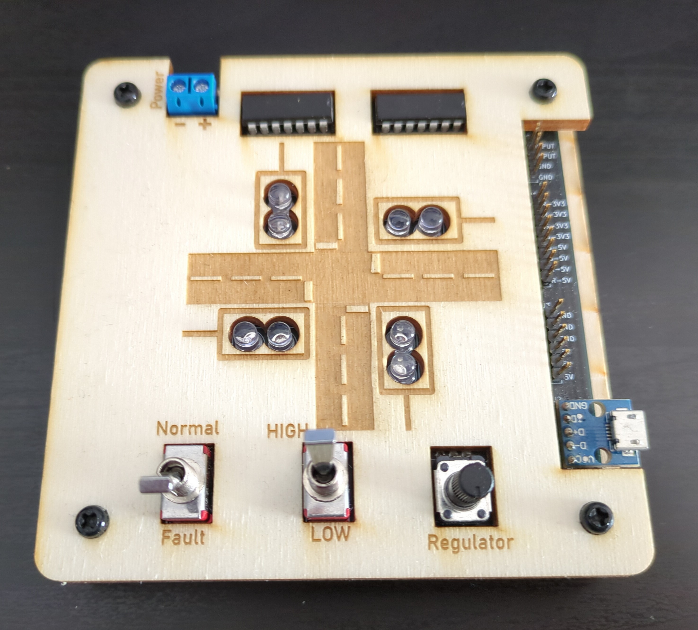
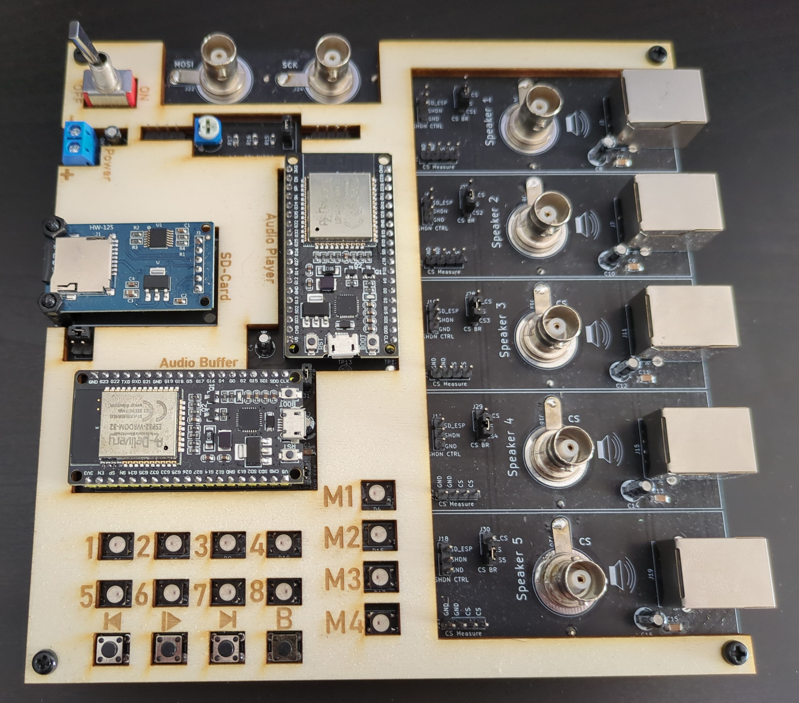
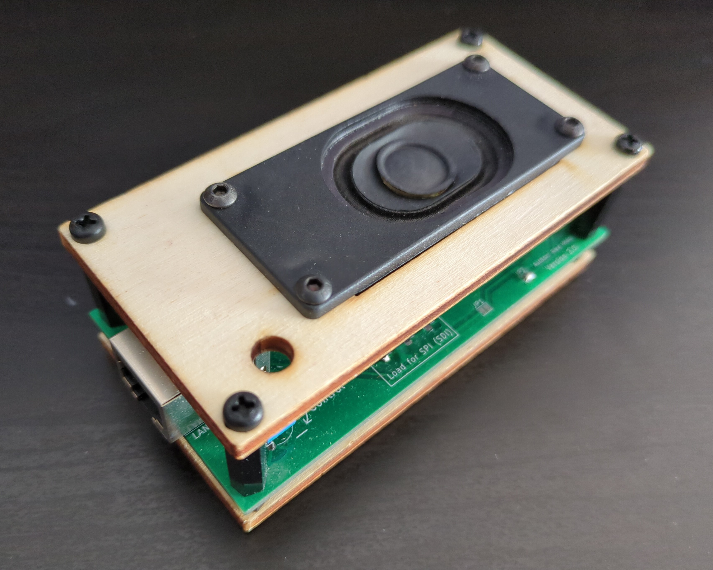

# Bachelor Thesis

This is the repository of my bachelor thesis for the Software Engineering
bachelor at TU-Vienna.

## Structure

```
.
├── Code/
│   ├── AmpelSchaltung
│   ├── AudioBuffer
│   ├── AudioPlayer
│   ├── ExperimentI2CSpeakerSystem
│   ├── ExperimentNandGatter
│   ├── ExperimentNandGatter2
│   ├── ExperimentNandGatterDACControl
│   └── I2CSpeakerSystemSDCard
├── FreeCAD/
│   ├── Ampel
│   ├── AudioController
│   ├── Speaker_Housing
│   └── ...
├── KiCAD/
│   ├── AmpelSchaltung
│   ├── AudioController
│   ├── CabelAdapter
│   ├── ExperimentNAND
│   └── Speaker
├── LtSpice/
│   ├── Metastabile-NAND-Gatter
│   ├── i2c_speaker_amp
│   └── models
├── Tools
├── bachelorThesisObsidian
├── latex
└── slides
```

- `Code`: Contains the firmware of the different prototypes, the most important firmware are:
  - `AmpelSchaltung`: Firmware for the Ampelschaltung
  - `AudioBuffer`: Firmware of the audio buffer on the audio control PCB
  - `AudioPlayer`: Firmware of the audio player on the audio control PCB
- `FreeCAD`: contains the housing of the different demonstrators, and also 3D models that where used in assemblies.
  - `Ampel`: housing for the Ampelschaltung
  - `AudioController`: housing of the controller part of the audio demonstrator
  - `Speaker_Housing`: housing of the speaker part of the audio demonstrator
- `KiCAD`: contains the schematics and the PCB of the demonstrators
- `LtSpice`: contains the simulations and also the LtSpice model of the DAC.
- `Tools`: contains the tools that were used to evaluated data, display data or to generate audio files (`.bwav`)
- `bachelorThesisObsidian`: contains a lot of addition information and the development process. Can be seen as an extension of the thesis. To view the files it is encouraged to use [obsidian](https://obsidian.md/), but is also possible to just view the plain markdown files.
- `latex`: contains the raw latex files to build the thesis
- `slides`: contains the slides that are used in the prolog. (Important: This is a submodule and one needs to have access rights to the prolog repo to clone this repository)

# Demonstrators:

## Ampelschaltung



## Audioschaltung




